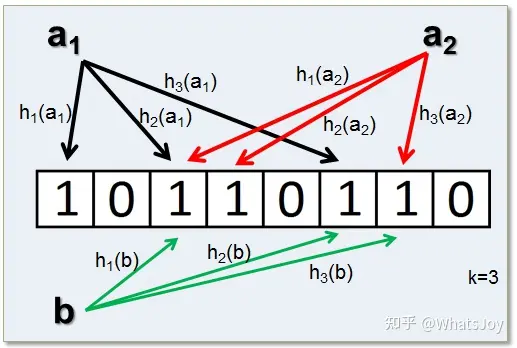

# 布隆过滤器

## 1.什么是布隆过滤器

> 布隆过滤器（Bloom Filter）是1970年由布隆提出的。它实际上是一个很长的二进制向量和一系列随机映射函数。布隆过滤器可以用于检索一个元素是否在一个集合中。

布隆过滤器是一种空间效率极高的概率型数据结构，它用来检测一个元素是不是在一个集合里。但是，它可能会产生错误正例（false positive）, 也就是可能会判断元素在集合里，但实际上并不在。因此，

当布隆过滤器说“可能在”的时候，那可能会有误差；

但是当它说“一定不在”的时候，那就是一定不在。

要搞懂布隆过滤器，这里有几个概念要先搞明白：

### 1.1hash函数

> Hash，一般翻译做散列、杂凑，或音译为哈希，是把任意长度的输入（又叫做预映射pre-image）通过散列算法变换成固定长度的输出，该输出就是散列值。这种转换是一种压缩映射，也就是，散列值的空间通常远小于输入的空间，不同的输入可能会散列成相同的输出，所以不可能从散列值来确定唯一的输入值。简单的说就是一种将任意长度的消息压缩到某一固定长度的消息摘要的函数。

### 1.2位图(bit map)

> 众所周知，一个字节等于8个比特位，比特(bit)是计算机最小的存储单元，一个比特位只有两种可能，要么是0，要么是1。
>
> 位图，可以看成是一个位数组，这个数组的元素的数据类型是位。

预备知识准备完了，进入正题

## 2.为什么要用布隆过滤器

> 假如给定一个集合，其中元素的个数为n，从中查询某个元素是否存在这个集合中，我们想到的实现方式可能有很多，比如数组，链表，队列，如果集合特别大的话，我们可能会用hash map来实现，hash map可以大大提高查询速度。
>
> 但是，如果集合中的数据大到会让内存也无法满足的地步，这个时候上面的这些选择就无法满足了，我们需要有一种**算法**，首先它的**空间要非常小**，其次他的**性能也要非常高**，刚好这两点，布隆过滤器都能满足。下面来详细介绍一下它是如何实现的

### 2.1 原理

上面我们已经介绍了哈希和位图的概念，这里我们简单讲一下布隆过滤器是如何利用hash和bit map实现的。

> 布隆过滤器的原理是，当一个元素被加入集合时，通过K个散列函数将这个元素映射成一个位数组中的K个点，把它们置为1。检索时，我们只要看看这些点是不是都是1就（大约）知道集合中有没有它了：如果这些点有任何一个0，则被检元素一定不在；如果都是1，则被检元素很可能在。

> 如上图所示， $a_1,a_2$表示集合中的元素，$h_1(),h_2(),h_3()$,表示3个散列函数， b为待查询的元素。

### 2.2优缺点

优点：
（1）布隆过滤器的空间效率和查询时间都远远超过一般的算法，布隆过滤器存储空间和插入/查询时间都是$O(k)$。
与之相比，链表、树、散列表等数据结构，随着集合中元素的增加，存储空间和检索时间会越来越大。上述三种结构的检索时间复杂度分别为 $O(n),$O(log_n),$O(1)$ 。
（2）散列函数相互之间没有关系，方便由硬件行并实现。

（3）布隆过滤器不需要存储元素本身，在某些对保密要求非常严格的场合有优势（比如联邦学习、区块链等）。

缺点：
（1）有一定的误算率，随着存入的元素数量增加，误算率也会随之增加。
（2）删除困难。一般情况下不能从布隆过滤器中删除元素。要保证安全地删除元素，首先必须保证删除的元素的确在布隆过滤器里面，而这一点是无法保证的。
