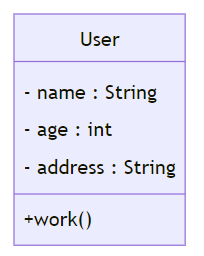
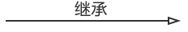
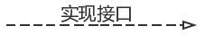
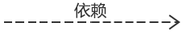
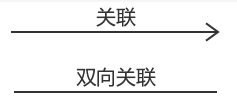
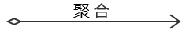
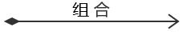

# 类

定义：类使用包含类名(className)、属性(field) 和方法(method) 且带有分割线的矩形来表示

UML类图中表示可见性的符号有三种：
``` text
- +：表示public
- -：表示private
- #：表示protected
- 默认不填: 表示default
```
# 类之间的关系
对于`继承(泛化)、实现(实现)`这两种关系比较简单，它们体现的是一种类与类、或者类与接口之间的<font color="#ff0000">纵向关系</font>。
其他的四种关系则体现的是类与类、或者类与接口之间的<font color="#ff0000">引用横向关系</font>。
这四种关系所表现的强弱程度来看，从强到弱依次为：`组合>聚合>关联>依赖`。

### 1. 继承 

### 2. 实现

### 3. 依赖

定义：一个类依赖于另一个类的定义。
表现：在Java语言中体现为**成员变量、局域变量、方法的形参、方法返回值**，或者对**静态方法的调用**
> 
### 4. 关联

关联关系：指的是`类与类之间的联接`，**`它使一个类知道另一个类的属性和方法（实例变量体现）`**。A类依赖于B对象,并且`把B作为A的一个成员变量`, 则A和B存在关联关系.
> 举个栗子：老师与学生 

### 5. 聚合



定义：聚合关系 也是通过**实例变量**实现的。但是关联关系所涉及的两个类是处在同一层次上的，而在聚合关系中，两个类是处在**不平等层次**上的，一个代表整体，另一个代表部分。
> 举个栗子：汽车类与引擎类、轮胎类，以及其它的零件类之间的关系便整体和个体的关系。
### 6. 组合

定义：整体和个体**不能独立存在**，一定是在一个模块中同时管理整体和个体，**生命周期必须相同**(级联)。
> 举个栗子：头和嘴巴的关系.
