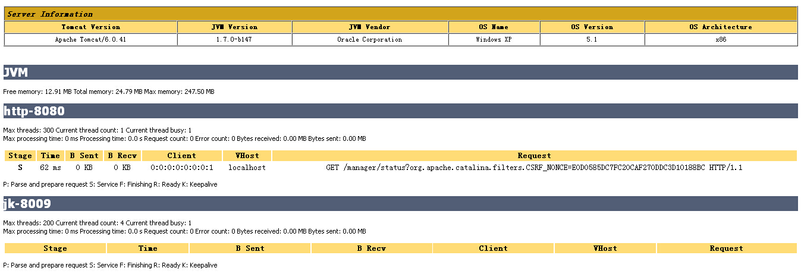

## 常见配置汇总
1. **常见配置汇总**
    1. 堆设置
        - **-Xms**:初始堆大小
        - **-Xmx**:最大堆大小
        - **-XX:NewSize=n**:设置年轻代大小
        - **-XX:NewRatio=n:**设置年轻代和年老代的比值。如:为3，表示年轻代与年老代比值为1：3，年轻代占整个年轻代年老代和的1/4
        - **-XX:SurvivorRatio=n**:年轻代中Eden区与两个Survivor区的比值。注意Survivor区有两个。如：3，表示Eden：Survivor=3：2，一个Survivor区占整个年轻代的1/5
        - **-XX:MaxPermSize=n**:设置持久代大小
    2. 收集器设置
        - **-XX:+UseSerialGC**:设置串行收集器
        - **-XX:+UseParallelGC**:设置并行收集器
        - **-XX:+UseParalledlOldGC**:设置并行年老代收集器
        - **-XX:+UseConcMarkSweepGC**:设置并发收集器
    3. 垃圾回收统计信息
        - **-XX:+PrintGC**
        - **-XX:+PrintGCDetails**
        - **-XX:+PrintGCTimeStamps**
        - **-Xloggc:filename**
    4. 并行收集器设置
        - **-XX:ParallelGCThreads=n**:设置并行收集器收集时使用的CPU数。并行收集线程数。
        - **-XX:MaxGCPauseMillis=n**:设置并行收集最大暂停时间
        - **-XX:GCTimeRatio=n**:设置垃圾回收时间占程序运行时间的百分比。公式为1/(1+n)
    5. 并发收集器设置
        - **-XX:+CMSIncrementalMode**:设置为增量模式。适用于单CPU情况。
        - **-XX:ParallelGCThreads=n**:设置并发收集器年轻代收集方式为并行收集时，使用的CPU数。并行收集线程数。

## 配置说明
1. **堆大小设置  
    **JVM 中最大堆大小有三方面限制：相关操作系统的数据模型（32-bt还是64-bit）限制；系统的可用虚拟内存限制；系统的可用物理内存限制。32位系统下，一般限制在1.5G~2G；64为操作系统对内存无限制。我在Windows Server 2003 系统，3.5G物理内存，JDK5.0下测试，最大可设置为1478m。  
    **典型设置：**
    - java**-Xmx3550m -Xms3550m -Xmn2g-Xss128k  
        -Xmx3550m**：设置JVM最大可用内存为3550M。  
        **-Xms3550m**：设置JVM促使内存为3550m。此值可以设置与-Xmx相同，以避免每次垃圾回收完成后JVM重新分配内存。  
        **-Xmn2g**：设置年轻代大小为2G。**整个堆大小=年轻代大小 + 年老代大小 + 持久代大小**。持久代一般固定大小为64m，所以增大年轻代后，将会减小年老代大小。此值对系统性能影响较大，Sun官方推荐配置为整个堆的3/8。  
        **-Xss128k**：设置每个线程的堆栈大小。JDK5.0以后每个线程堆栈大小为1M，以前每个线程堆栈大小为256K。更具应用的线程所需内存大小进行调整。在相同物理内存下，减小这个值能生成更多的线程。但是操作系统对一个进程内的线程数还是有限制的，不能无限生成，经验值在3000~5000左右。
    - java -Xmx3550m -Xms3550m -Xss128k**-XX:NewRatio=4 -XX:SurvivorRatio=4 -XX:MaxPermSize=16m -XX:MaxTenuringThreshold=0  
        -XX:NewRatio=4**:设置年轻代（包括Eden和两个Survivor区）与年老代的比值（除去持久代）。设置为4，则年轻代与年老代所占比值为1：4，年轻代占整个堆栈的1/5  
        **-XX:SurvivorRatio=4**：设置年轻代中Eden区与Survivor区的大小比值。设置为4，则两个Survivor区与一个Eden区的比值为2:4，一个Survivor区占整个年轻代的1/6  
        **-XX:MaxPermSize=16m**:设置持久代大小为16m。  
        **-XX:MaxTenuringThreshold=0**：设置垃圾最大年龄。**如果设置为0的话，则年轻代对象不经过Survivor区，直接进入年老代**。对于年老代比较多的应用，可以提高效率。**如果将此值设置为一个较大值，则年轻代对象会在Survivor区进行多次复制，这样可以增加对象再年轻代的存活时间**，增加在年轻代即被回收的概论。
2. **回收器选择  
    **JVM给了三种选择：**串行收集器、并行收集器、并发收集器**，但是串行收集器只适用于小数据量的情况，所以这里的选择主要针对并行收集器和并发收集器。默认情况下，JDK5.0以前都是使用串行收集器，如果想使用其他收集器需要在启动时加入相应参数。JDK5.0以后，JVM会根据当前[系统配置](http://java.sun.com/j2se/1.5.0/docs/guide/vm/server-class.html)进行判断。
    1. **吞吐量优先**的并行收集器  
        如上文所述，并行收集器主要以到达一定的吞吐量为目标，适用于科学技术和后台处理等。  
        **典型配置**：
        - java -Xmx3800m -Xms3800m -Xmn2g -Xss128k**-XX:+UseParallelGC -XX:ParallelGCThreads=20  
            -XX:+UseParallelGC**：选择垃圾收集器为并行收集器。**此配置仅对年轻代有效。即上述配置下，年轻代使用并发收集，而年老代仍旧使用串行收集。  
            -XX:ParallelGCThreads=20**：配置并行收集器的线程数，即：同时多少个线程一起进行垃圾回收。此值最好配置与处理器数目相等。
        - java -Xmx3550m -Xms3550m -Xmn2g -Xss128k -XX:+UseParallelGC -XX:ParallelGCThreads=20**-XX:+UseParallelOldGC  
            -XX:+UseParallelOldGC**：配置年老代垃圾收集方式为并行收集。JDK6.0支持对年老代并行收集。
        - java -Xmx3550m -Xms3550m -Xmn2g -Xss128k -XX:+UseParallelGC**-XX:MaxGCPauseMillis=100  
            -XX:MaxGCPauseMillis=100:**设置每次年轻代垃圾回收的最长时间，如果无法满足此时间，JVM会自动调整年轻代大小，以满足此值。
        - java -Xmx3550m -Xms3550m -Xmn2g -Xss128k -XX:+UseParallelGC -XX:MaxGCPauseMillis=100**-XX:+UseAdaptiveSizePolicy  
            -XX:+UseAdaptiveSizePolicy**：设置此选项后，并行收集器会自动选择年轻代区大小和相应的Survivor区比例，以达到目标系统规定的最低相应时间或者收集频率等，此值建议使用并行收集器时，一直打开。
    2. **响应时间优先**的并发收集器  
        如上文所述，并发收集器主要是保证系统的响应时间，减少垃圾收集时的停顿时间。适用于应用服务器、电信领域等。  
        **典型配置**：
        - java -Xmx3550m -Xms3550m -Xmn2g -Xss128k -XX:ParallelGCThreads=20**-XX:+UseConcMarkSweepGC -XX:+UseParNewGC  
            -XX:+UseConcMarkSweepGC**：设置年老代为并发收集。测试中配置这个以后，-XX:NewRatio=4的配置失效了，原因不明。所以，此时年轻代大小最好用-Xmn设置。  
            **-XX:+UseParNewGC**:设置年轻代为并行收集。可与CMS收集同时使用。JDK5.0以上，JVM会根据系统配置自行设置，所以无需再设置此值。
        - java -Xmx3550m -Xms3550m -Xmn2g -Xss128k -XX:+UseConcMarkSweepGC**-XX:CMSFullGCsBeforeCompaction=5 -XX:+UseCMSCompactAtFullCollection  
            -XX:CMSFullGCsBeforeCompaction**：由于并发收集器不对内存空间进行压缩、整理，所以运行一段时间以后会产生“碎片”，使得运行效率降低。此值设置运行多少次GC以后对内存空间进行压缩、整理。  
            **-XX:+UseCMSCompactAtFullCollection**：打开对年老代的压缩。可能会影响性能，但是可以消除碎片
3. **辅助信息  
    **JVM提供了大量命令行参数，打印信息，供调试使用。主要有以下一些：
    - **-XX:+PrintGC  
        **输出形式**：[GC 118250K->113543K(130112K), 0.0094143 secs]**
        
         **[Full GC 121376K->10414K(130112K), 0.0650971 secs]**
        
    - **-XX:+PrintGCDetails  
        **输出形式**：[GC [DefNew: 8614K->781K(9088K), 0.0123035 secs] 118250K->113543K(130112K), 0.0124633 secs]**
        
         **[GC [DefNew: 8614K->8614K(9088K), 0.0000665 secs][Tenured: 112761K->10414K(121024K), 0.0433488 secs] 121376K->10414K(130112K), 0.0436268 secs]**
        
    - **-XX:+PrintGCTimeStamps**-XX:+PrintGC：PrintGCTimeStamps可与上面两个混合使用  
        输出形式：**11.851: [GC 98328K->93620K(130112K), 0.0082960 secs]  
        **
    - **-XX:+PrintGCApplicationConcurrentTime:**打印每次垃圾回收前，程序未中断的执行时间。可与上面混合使用  
        输出形式：**Application time: 0.5291524 seconds  
        **
    - **-XX:+PrintGCApplicationStoppedTime**：打印垃圾回收期间程序暂停的时间。可与上面混合使用  
        输出形式：**Total time for which application threads were stopped: 0.0468229 seconds  
        **
    - **-XX:PrintHeapAtGC**:打印GC前后的详细堆栈信息  
        输出形式：
		> 
        34.702: [GC {Heap before gc invocations=7:  
        def new generation total 55296K, used 52568K [0x1ebd0000, 0x227d0000, 0x227d0000)  
        **eden space 49152K, 99% used**[0x1ebd0000, 0x21bce430, 0x21bd0000)  
        **from space 6144K, 55% used**[0x221d0000, 0x22527e10, 0x227d0000)  
        to space 6144K, 0% used [0x21bd0000, 0x21bd0000, 0x221d0000)  
        tenured generation total 69632K, used 2696K [0x227d0000, 0x26bd0000, 0x26bd0000)  
        **the space 69632K, 3% used**[0x227d0000, 0x22a720f8, 0x22a72200, 0x26bd0000)  
        compacting perm gen total 8192K, used 2898K [0x26bd0000, 0x273d0000, 0x2abd0000)  
         the space 8192K, 35% used [0x26bd0000, 0x26ea4ba8, 0x26ea4c00, 0x273d0000)  
         ro space 8192K, 66% used [0x2abd0000, 0x2b12bcc0, 0x2b12be00, 0x2b3d0000)  
         rw space 12288K, 46% used [0x2b3d0000, 0x2b972060, 0x2b972200, 0x2bfd0000)  
        34.735: [DefNew: 52568K->3433K(55296K), 0.0072126 secs] 55264K->6615K(124928K)**Heap after gc invocations=8:  
        **def new generation total 55296K, used 3433K [0x1ebd0000, 0x227d0000, 0x227d0000)  
        **eden space 49152K, 0% used**[0x1ebd0000, 0x1ebd0000, 0x21bd0000)  
        from space 6144K, 55% used [0x21bd0000, 0x21f2a5e8, 0x221d0000)  
        to space 6144K, 0% used [0x221d0000, 0x221d0000, 0x227d0000)  
        tenured generation total 69632K, used 3182K [0x227d0000, 0x26bd0000, 0x26bd0000)  
        **the space 69632K, 4% used**[0x227d0000, 0x22aeb958, 0x22aeba00, 0x26bd0000)  
        compacting perm gen total 8192K, used 2898K [0x26bd0000, 0x273d0000, 0x2abd0000)  
         the space 8192K, 35% used [0x26bd0000, 0x26ea4ba8, 0x26ea4c00, 0x273d0000)  
         ro space 8192K, 66% used [0x2abd0000, 0x2b12bcc0, 0x2b12be00, 0x2b3d0000)  
         rw space 12288K, 46% used [0x2b3d0000, 0x2b972060, 0x2b972200, 0x2bfd0000)  
        }  
        , 0.0757599 secs]
    - **-Xloggc:filename**:与上面几个配合使用，把相关日志信息记录到文件以便分析。

## 调优总结

1. **年轻代大小选择**
    - **响应时间优先的应用**：**尽可能设大，直到接近系统的最低响应时间限制**（根据实际情况选择）。在此种情况下，年轻代收集发生的频率也是最小的。同时，减少到达年老代的对象。
    - **吞吐量优先的应用**：尽可能的设置大，可能到达Gbit的程度。因为对响应时间没有要求，垃圾收集可以并行进行，一般适合8CPU以上的应用。
2. **年老代大小选择**
    - **响应时间优先的应用**：年老代使用并发收集器，所以其大小需要小心设置，一般要考虑**并发会话率**和**会话持续时间**等一些参数。如果堆设置小了，可以会造成内存碎片、高回收频率以及应用暂停而使用传统的标记清除方式；如果堆大了，则需要较长的收集时间。最优化的方案，一般需要参考以下数据获得：
        - 并发垃圾收集信息
        - 持久代并发收集次数
        - 传统GC信息
        - 花在年轻代和年老代回收上的时间比例减少年轻代和年老代花费的时间，一般会提高应用的效率
    - **吞吐量优先的应用**：一般吞吐量优先的应用都有一个很大的年轻代和一个较小的年老代。原因是，这样可以尽可能回收掉大部分短期对象，减少中期的对象，而年老代尽存放长期存活对象。
3. **较小堆引起的碎片问题  
    **因为年老代的并发收集器使用标记、清除算法，所以不会对堆进行压缩。当收集器回收时，他会把相邻的空间进行合并，这样可以分配给较大的对象。但是，当堆空间较小时，运行一段时间以后，就会出现“碎片”，如果并发收集器找不到足够的空间，那么并发收集器将会停止，然后使用传统的标记、清除方式进行回收。如果出现“碎片”，可能需要进行如下配置：
    - **-XX:+UseCMSCompactAtFullCollection**：使用并发收集器时，开启对年老代的压缩。
    - **-XX:CMSFullGCsBeforeCompaction=0**：上面配置开启的情况下，这里设置多少次Full GC后，对年老代进行压缩

**我在tomcat中的jvm连接数，和tomcat优化的使用如下：**

1、 tomcat7安装目录\bin\catalina.bat  (linux修改的是catalina.sh文件)

添加如下语句：

JAVA_OPTS=-Djava.awt.headless=true-Dfile.encoding=UTF-8-server -Xms1024m -Xmx1024m -Xss1m -XX:NewSize=256m-XX:MaxNewSize=512m-XX:PermSize=256M -XX:MaxPermSize=512m

-XX:+DisableExplicitGC

2、查看tomcat的JVM内存

tomcat7中默认没有用户的，我们首先要添加用户有：

修改tomcat7安装目录下\conf\tomcat-users.xml

  
<!--############################################################-->  
<!--添加tomcat用户管理-->  
<rol rolename="manager-gui"/>  
<user username="tomcat" password="tomcat" roles="manager-gui"/>  
<!--############################################################-->

password是可以自由定义的。

3、检查webapps下是否有Manager目录，一般发布时我们都把这个目录删除了，现在看来删除早了，在调试期要保留啊！

4、访问地址：

http://localhost:8080/manager/status

查看内存配置情况，经测试-Xms512m -Xmx512m与-Xms1024m -Xmx1024m内存使用情况不一样，使用1024的时候有一项内存使用99%。所以看来这个设置多少与实际机器有关，需要Manager进行查看后确定。

5、在启动Tomcat中发现，有同志发布程序时把我们在TOMCAT7中引用的外部JAR包重复发布到LIB目录下了，我们以后在发布时要检查LIB下是不是包括

el-api.jarjsp-apiservlet-api,特别注意的是最后一个servlet-api，我发现两个项目都把它拷贝到了LIB目录下！！被我删除了。

6、使用TOMAT的连接池：
```text

<Executor name="tomcatThreadPool" namePrefix="catalina-exec-" maxThreads="300" minSpareThreads="50"maxIdleTime="15000"/>

  
<Connector port="8080

 executor="tomcatThreadPool"

 protocol="org.apache.coyote.http11.Http11NioProtocol"  
 redirectPort="8443"

 connectionTimeout="30000"

 enableLookups="false"

 keepAliveTimeout="15000"

 URIEncoding="UTF-8"

 maxHttpHeaderSize="32768"

 acceptCount="200"/>

说明：

maxThreads：最大线程数 300

minSpareThreads：初始化建立的线程数 50

maxThreads：一旦线程超过这个值，Tomcat就会关闭不再需要的线程

maxIdleTime：为最大空闲时间、单位为毫秒。

executor为线程池的名字，对应Executor中的name属性；Connector标签中不再有maxThreads的设置。

如果tomcat不使用线程池则基本配置如下：

<Connector port="8080" 

 protocol="HTTP/1.1" 

 redirectPort="8443" 

 connectionTimeout="30000" 

 keepAliveTimeout="15000" 

 enableLookups="false" 

 URIEncoding="UTF-8" 

 maxHttpHeaderSize="32768" 

 maxThreads="300" 

 acceptCount="200" 

/> 

```

修改Tomcat的/conf目录下面的server.xml文件，针对端口为8080的连接器添加如下参数：


 1. connectionTimeout：连接失效时间，单位为毫秒、默认为60s、这里设置为30s，如果用户请求在30s内未能进入请求队列，视为本次连接失败。

 2. keepAliveTimeout：连接的存活时间，默认和connectionTimeout一致，这里可以设为15s、这意味着15s之后本次连接关闭. 如果页面需要加载大量图片、js等静态资源，需要将参数适当调大一点、以免多次创建TCP连接。

 3. enableLookups：是否对连接到服务器的远程机器查询其DNS主机名，一般情况下这并不必要，因此设为false即可。

 4. URIEncoding：设置URL参数的编码格式为UTF-8编码，默认为ISO-8859-1编码。

 5. maxHttpHeaderSize：设置HTTP请求、响应的头部内容大小，默认为8192字节(8k)，此处设置为32768字节(32k)、和Nginx的设置保持一致。

 6. maxThreads：最大线程数、用于处理用户请求的线程数目，默认为200、此处设置为300

 7. acceptCount：用户请求等候队列的大小，默认为100、此处设置为200

Linux系统默认一个进程能够创建的最大线程数为1024、因此对高并发应用需要进行Linux内核调优，至此文件server.xml修改后的内容如下所示：吻

<Connector port="8080"
protocol="HTTP/1.1"
redirectPort="8443"
connectionTimeout="30000"
keepAliveTimeout="15000"
enableLookups="false"
URIEncoding="UTF-8"
maxHttpHeaderSize="32768"
maxThreads="300"
acceptCount="200"
/>


【线程池技术】天真

 默认情况下，Tomcat针对每个用户请求都单独创建一个线程，用户请求处理完成后又将线程立即销毁掉，在并发访问量很高的情况下，线程的创建和销毁会带来比较大的系统开销。因此有必要使用Tomcat提供的线程池功能，下面是设置Tomcat线程池的示例：

 1. 修改连接器的设置：指定executor的name为线程池的名字、同时去掉最大线程数maxThreads的设置。

<Connector executor="tomcatThreadPool"
port="8080"
protocol="HTTP/1.1"
redirectPort="8443"
connectionTimeout="30000"
keepAliveTimeout="15000"
enableLookups="false"
URIEncoding="UTF-8"
maxHttpHeaderSize="32768"
acceptCount="200"
/>
2. 线程池参数的设置： 尴尬

<Executor name="tomcatThreadPool"
namePrefix="catalina-exec-"
maxThreads="300"
minSpareThreads="50"
maxIdleTime = "15000"
/>
说明：

 1. 通过namePrefix属性指定用户线程的命名前缀为“catalina-exec-”。

 2. maxThreads为最大线程数，minSpareThreads为最小空闲线程数，maxIdleTime为最大空闲时间、单位为毫秒。


【使用Tomcat管理平台】惊讶

 修改Tomcat的conf目录下面的tomcat-users.xml文件，添加如下内容：

<user username="nick" password="123456" roles="manager"/>
启动Tomcat之后，通过http://localhost:8080访问欢迎页，点击左侧的Tomcat Manager链接，
输入上面设置的账号后，在打开的页面点击Server Status链接进入Tomcat监控页面，
可以查看到JVM、Tomcat的一些环境信息，以及当前的用户线程数：




  

参考：

[http://blog.sina.com.cn/s/blog_3f12afd00100zpvf.html](http://blog.sina.com.cn/s/blog_3f12afd00100zpvf.html)

tomcat7 正式环境的优化

[http://energykey.iteye.com/blog/2072797](http://energykey.iteye.com/blog/2072797)

tomcat内存配置优化

[http://blog.csdn.net/kefeng824/article/details/31742423](http://blog.csdn.net/kefeng824/article/details/31742423)

CentOS 6.5 下的tomcat优化

[http://www.cnblogs.com/littlehb/archive/2013/04/02/2994785.html](http://www.cnblogs.com/littlehb/archive/2013/04/02/2994785.html)

JVM（Java虚拟机）优化大全和案例实战--(重点推荐)

[http://blog.csdn.net/kthq/article/details/8618052](http://blog.csdn.net/kthq/article/details/8618052)
