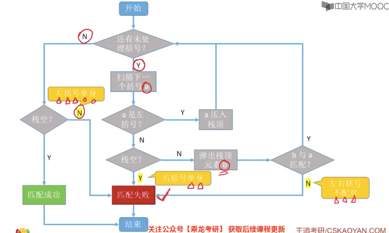
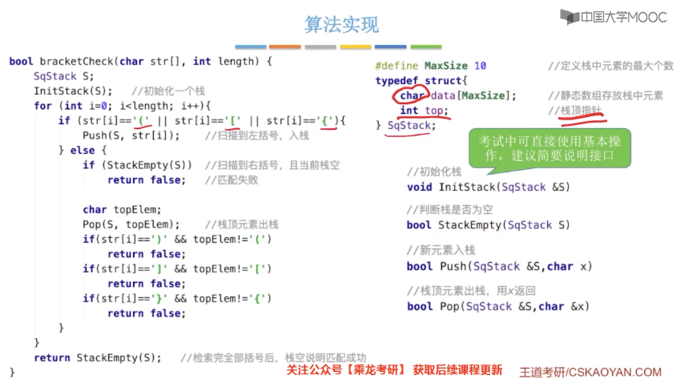
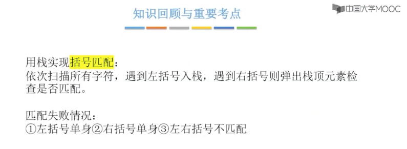

# 栈在括号匹配中的应用

## 流程图

## 算法实现

## 小结

文档

https://github.com/fmw666/Data-Structure/blob/master/docs/%E7%AC%AC3%E7%AB%A0/3.3%20%E6%A0%88%E5%92%8C%E9%98%9F%E5%88%97%E7%9A%84%E5%BA%94%E7%94%A8/3.3.1%20%E6%A0%88%E5%9C%A8%E6%8B%AC%E5%8F%B7%E5%8C%B9%E9%85%8D%E4%B8%AD%E7%9A%84%E5%BA%94%E7%94%A8.md

视频

https://www.youtube.com/watch?v=mSfV6RwK25Q
